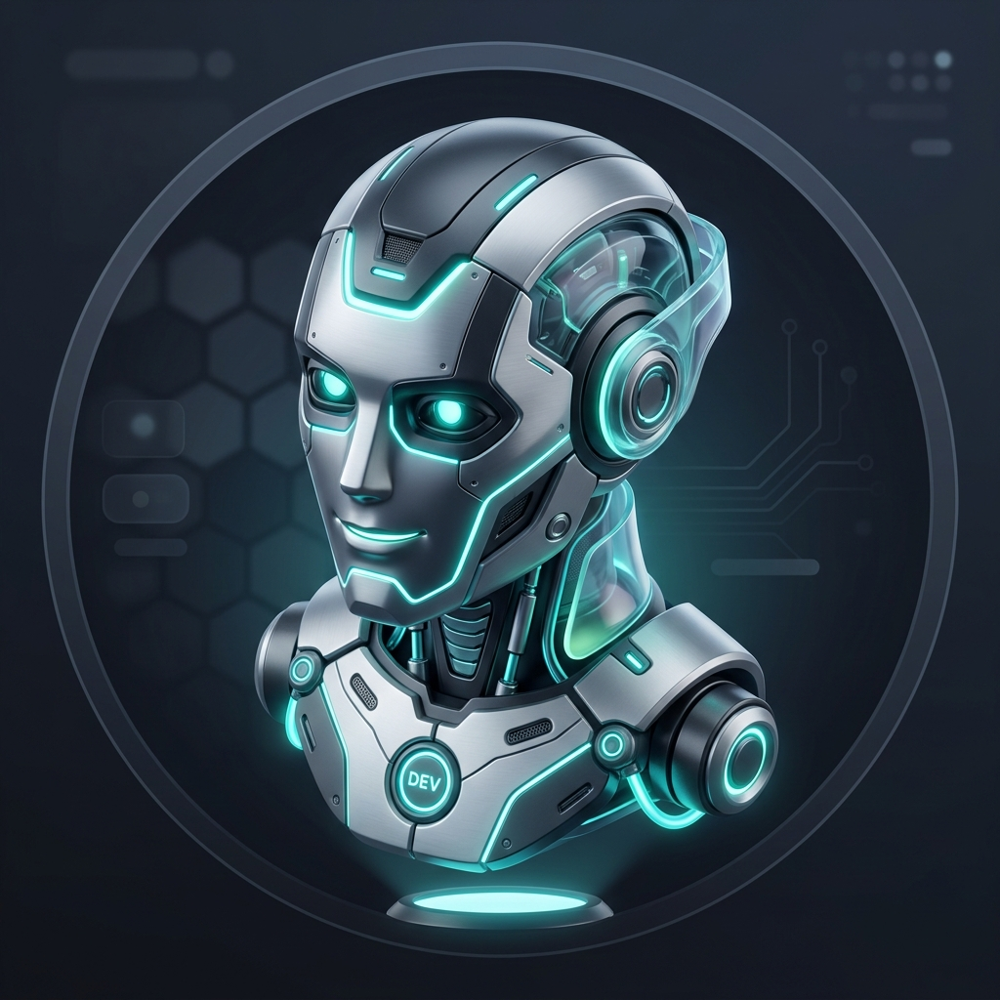

  

 

<table border="0" width="100%">
  <tr>
    <td width="75%" valign="middle">
      <h1>👋 Hi, I'm Ritik Singh!</h1>
      
<b>Software Engineer | Cognitive Security Researcher | Systems Observability Engineer</b>

      

        
        
        
      

    </td>
    <td width="25%" align="center" valign="middle">
      
    </td>
  </tr>
</table>

---

### 🌟 About Me

I design and build **intelligent, observable, and secure software ecosystems**. My work spans developing cognitive security agents that autonomously secure web applications, implementing full-stack observability pipelines in cloud-native environments, and training specialized neural architectures.

---

### 📊 My 3D Contribution Space
Below is the live 3D contribution mapping generated by my daily telemetry pipeline:

  

---

### 🛡️ Highlighted Projects

<table width="100%">
  <tr>
    <td width="50%" valign="top">
      <h4>🛡️ SECUREWAY</h4>
      
<i>The Phase 0 Cognitive Security Logic Engine</i>

      <ul>
        <li>Autonomous DAST/SAST agent mimicking human security operators.</li>
        <li><b>Stack</b>: Django 5.x, FastAPI, Celery, Redis, PyTorch LSTMs, Presidio.</li>
        <li><b>Features</b>: Shadow DOM crawler, AST self-healing patches, Shodan & Kali Linux MCP interfaces.</li>
      </ul>
    </td>
    <td width="50%" valign="top">
      <h4>📊 O11ypossible</h4>
      
<i>Kubernetes Observability & Alerting Infrastructure</i>

      <ul>
        <li>Multi-service telemetry orchestration and alerting pipelines.</li>
        <li><b>Stack</b>: OpenTelemetry, Prometheus, PromQL, Dash0 Engine.</li>
        <li><b>Features</b>: Self-escalating alerts, dynamic PromQL thresholds, service error profiling.</li>
      </ul>
    </td>
  </tr>
  <tr>
    <td colspan="2" valign="top">
      <h4>🤖 Stark AI</h4>
      
<i>Agentic Assistant Orchestrator & UI</i>

      <ul>
        <li>Modern full-stack developer assistant powered by real-time agentic reasoning steps.</li>
        <li><b>Stack</b>: React, TypeScript, FastAPI, WebSockets.</li>
      </ul>
    </td>
  </tr>
</table>

---

### 🛠️ Technical Arsenal

  
  #### 💻 Languages
  
  
  
  
  
  
  #### ⚙️ Frameworks & Backends
  
  
  
  
  
  
  #### 🧠 AI / ML & Observability
  
  
  
  
  

---

### 📈 Metrics & Stats

  <table border="0">
    <tr>
      <td>
        
      </td>
      <td>
        
      </td>
    </tr>
    <tr>
      <td colspan="2" align="center">
        
      </td>
    </tr>
  </table>

---

  <i>"Building secure, observable, and intelligent systems."</i>

